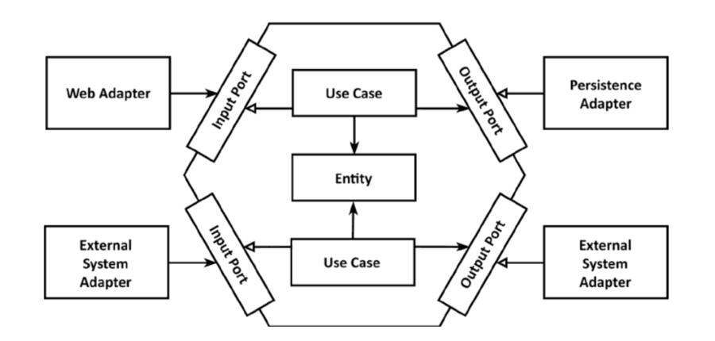

[](https://sonarcloud.io/summary/new_code?id=Guguskis_TodoApp)
[](https://sonarcloud.io/summary/new_code?id=Guguskis_TodoApp)
[](https://sonarcloud.io/summary/new_code?id=Guguskis_TodoApp)

[](https://sonarcloud.io/summary/new_code?id=Guguskis_TodoApp)
[](https://sonarcloud.io/summary/new_code?id=Guguskis_TodoApp)
[](https://sonarcloud.io/summary/new_code?id=Guguskis_TodoApp)
[](https://sonarcloud.io/summary/new_code?id=Guguskis_TodoApp)
[](https://sonarcloud.io/summary/new_code?id=Guguskis_TodoApp)

# news-service

REST API aggregating news data

Swagger API docs `http://localhost:9081/swagger-ui/index.html`

### Stomp Websocket

`ws://localhost:9081/news/websocket`

Subscribe to news feed:

* Subscribe `/user/topic/news`
* Send message `/app/queue/news`

#### Request:

```json
{
  "action": "SUBSCRIBE",
  "channel": "REDDIT",
  "subChannels": [
    "EyeBleach",
    "explainlikeimfive",
    "funny"
  ]
}
```

#### Response:

```json
{
  "id": 1,
  "title": "She is gonna take away jobs",
  "url": "https://old.reddit.com/r/funny/comments/v06dct/she_is_gonna_take_away_jobs/",
  "created": "2022-05-29T17:22:18Z",
  "subChannel": "funny",
  "channel": "REDDIT"
}
```

## Architecture



Project's hexagonal architecture (see picture above) is based on domain driven design. At the core **UseCase** operates 
on **Entity** completely decoupling business logic from technical details, aka **Adapter**. 